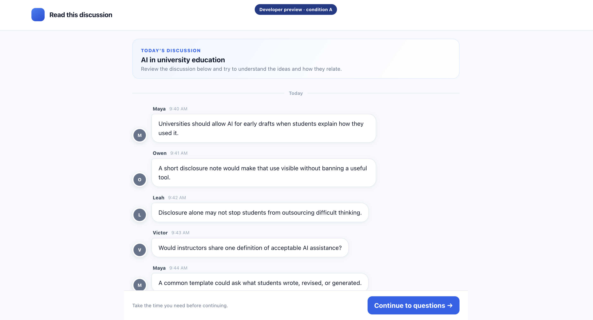
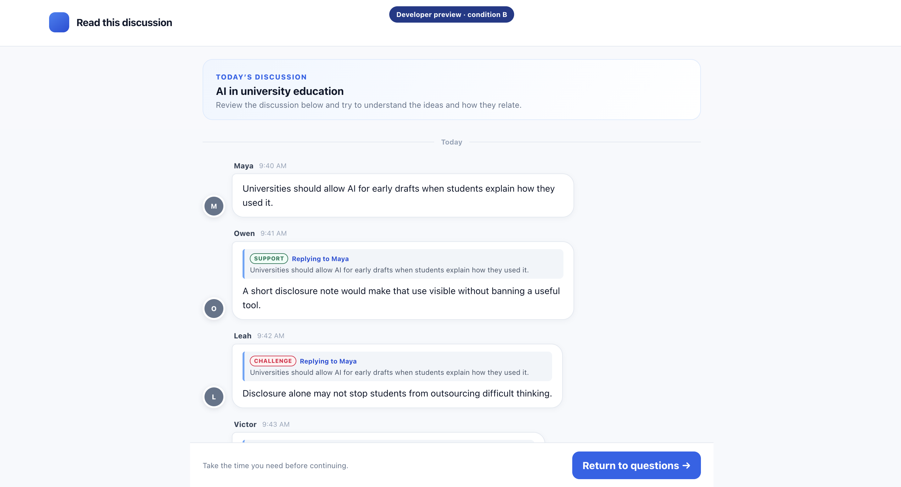
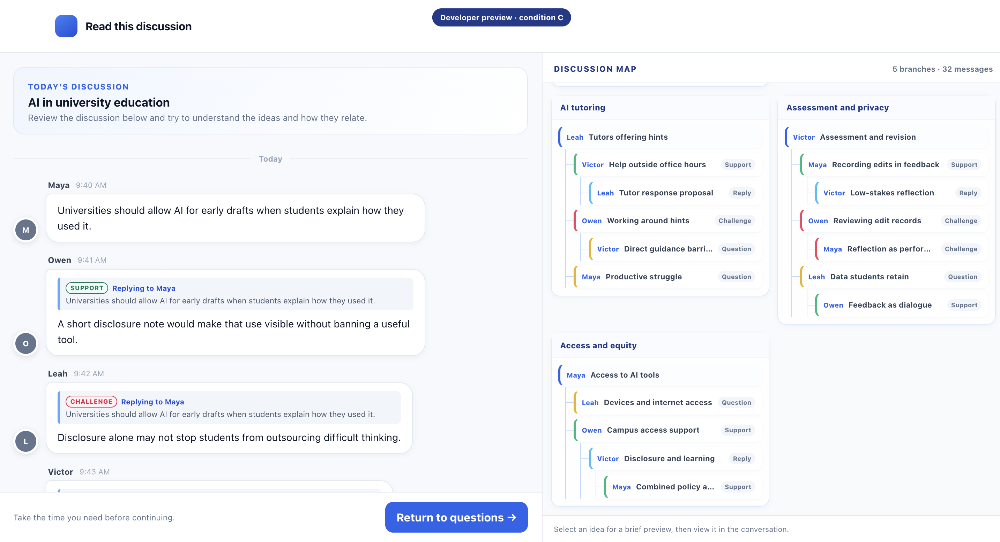

# CogniWeave

CogniWeave is a research-driven conversation workspace exploring how different discussion interface structures affect participation, navigation, cognitive load, and idea generation.

## Live Demo

Explore the public interface demo on Vercel. This is **not an active research study**, and no research response data is collected through these links.

| Condition | Interface structure | Demo |
| --- | --- | --- |
| A — Baseline | Plain chronological chat without relational cues or a map. | [Open Condition A](https://cogni-weave.vercel.app/?previewCondition=A) |
| B — Local relational cues | Chronological chat with inline reply context and relation labels, but no global map. | [Open Condition B](https://cogni-weave.vercel.app/?previewCondition=B) |
| C — Local + global structure | Condition B's local cues plus a grouped discussion map for navigation. | [Open Condition C](https://cogni-weave.vercel.app/?previewCondition=C) |

## Overview

Complex group conversations often contain several related threads, while chronological chat makes those relationships difficult to trace. CogniWeave is an interactive HCI research prototype that compares progressively more explicit forms of conversational structure to study their effect on navigation and understanding.

The repository includes both a normal product prototype and a read-only, browser-based experiment. The experiment presents the same authored discussions under three interface conditions, followed by comprehension questions, ratings, and questionnaires.

## Experimental Conditions

### Condition A — Baseline chronological chat

Plain chronological chat with no reply context, relation labels, or global map.



### Condition B — Local relational cues

Chronological chat with inline reply context and relation labels, but no global map.



### Condition C — Local + global structure

The same local cues as Condition B plus a grouped discussion map for global structure and navigation.



## Technical Implementation

- **Interface and navigation:** The normal prototype is built with React, TypeScript, and Vite. It includes a landing flow, mode selection, a three-question preference quiz, a chat workspace with replies and reactions, and an editable discussion-tree canvas.
- **Condition control:** The experiment reuses the shared `ChatView` component. Condition flags determine whether reply context, relation labels, and the grouped map appear, keeping the discussion content consistent across A, B, and C.
- **Conversation structure:** Messages retain `replyToId` and `parentId` references. The Condition C map uses an explicit reply reference first, then falls back to the parent reference, to render grouped parent-child branches. Selecting a chat message focuses its map node; selecting a map node opens a compact preview, whose **View in conversation** action locates and highlights the original chat message.
- **Experiment workflow:** Participants enter an ID, read instructions, complete three discussion trials, answer comprehension questions, rate each trial, complete background and final questionnaires, and reach an export page. Participant IDs deterministically select counterbalanced condition and topic sequences. Researcher/demo sessions use a fixed **A → B → C** condition order.
- **Storage, logging, and export:** The active experiment session and interaction events are stored in browser `localStorage`. The event log includes trial, question, rating, chat, and map interactions. At the end of a researcher session, the app can download a JSON record and a CSV trial summary locally.

## Local Preview Routes

For local development, start the Vite server first. These `localhost` links are separate from the public demo above.

| View | Local URL |
| --- | --- |
| Condition A preview | [http://localhost:5173/?previewCondition=A](http://localhost:5173/?previewCondition=A) |
| Condition B preview | [http://localhost:5173/?previewCondition=B](http://localhost:5173/?previewCondition=B) |
| Condition C preview | [http://localhost:5173/?previewCondition=C](http://localhost:5173/?previewCondition=C) |

The research-only `main` branch also includes local participant and researcher experiment entry points. They are intentionally disabled on the public `demo-public` branch.

## Running Locally

```bash
npm install
npm run dev
```

Vite prints the local URL when the server starts, typically `http://localhost:5173/`.

## Research Status and Limitations

CogniWeave is an active HCI research prototype, not a production collaboration service. Experiment sessions, event logs, and exports remain in the participant's browser; there is no server-side database, shared real-time discussion, or centralized data collection in this repository. The supplied discussions are authored study stimuli rather than live participant conversations.
